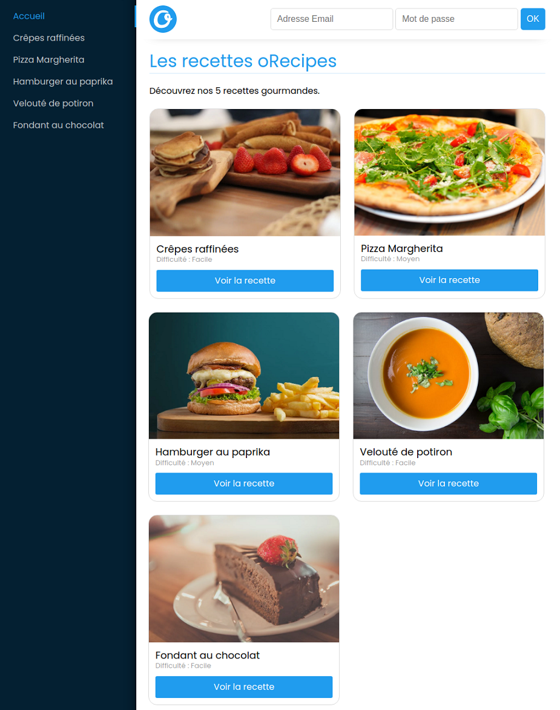
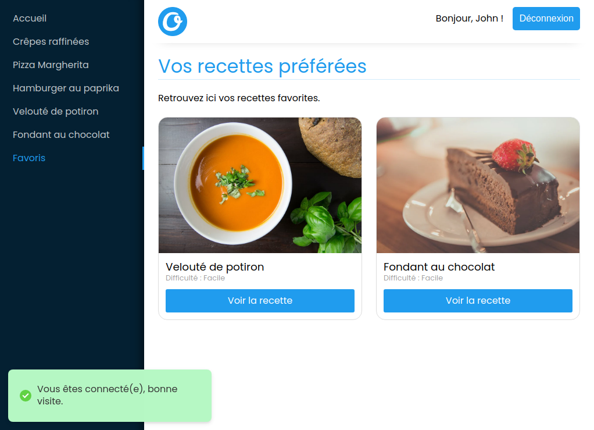

# MyRecipes

_Projet réalisé dans le cadre de ma formation chez O'clock_

Ce projet utilise `redux`, `react-redux`, `react-router-dom`, `axios`, `react-hot-toast`

Pour lancer le serveur local taper `yarn start` dans le terminal

Afin d'avoir accès aux recettes, utiliser le repo [MyRecipes-Server](https://github.com/LaurentArcos/MyRecipes-Server)

## Aperçu du site

